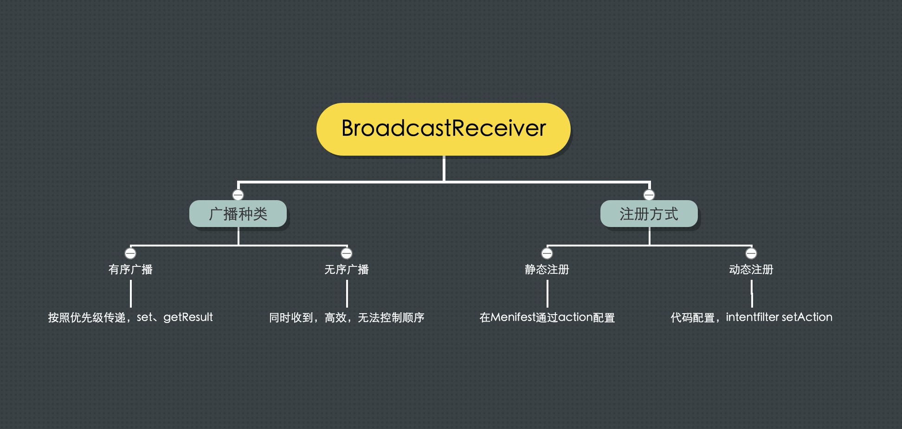

# 四大组件之 BroadcastReceiver



## 1. 注册步骤

应用可以通过两种方式接收广播：`清单声明的接收器`和 `上下文注册的接收器`

清单声明的接收器 也就是在 menifest 文件里面进行声明

上下文注册的接收器 也就是在代码里面用 context 进行声明


### 一、静态注册

显式在 menifest 文件里面进行注册

1. 首先创建 MyBroadcastReceiver 继承自 BroadcastReceiver，然后实现他的 onReceive\(\) 方法
2. 在 menifest 文件里面的标签下，用标签来声明自己注册的 receiver

```text
<receiver
    android:name=".MyBroadcastReceiver"
    android:enabled="true"
    android:exported="true">
    <intent-filter>
        <action android:name="android.intent.action.BOOT_COMPLETED" />
        <action android:name="android.intent.action.INPUT_METHOD_CHANGED" />
        <action android:name="android.intent.action.LOCALE_CHANGED" />
        <action android:name="com.licoba.action.CUSTOM_MSG" />
    </intent-filter>
</receiver>
```

**静态注册广播的特点是：广播常驻后台，不会随着其他组件的消亡而变化。这样的话不仅占用内存，而且会增加应用的耗电量。**

### 二、 动态注册

`registerReceiver(mBroadcastReceiver, intentFilter);` 和 `unregisterReceiver(mBroadcastReceiver);`方法，成对调用就可以了

**对于动态广播，有注册就必然得有注销，否则会导致内存泄露**

## 2. 广播种类

### 有序广播

有序广播，即从优先级别最高的广播接收器开始接收，接收完了如果没有丢弃，就下传给下一个次高优先级别的广播接收器进行处理，依次类推，直到最后。

有序广播，通过指定 Broadcast 的优先级，来实现消息的传递，所有的 receiver 依次执行

可以有 sendResult、getResult、abortBroadcast 方法来继承、终止消息的传递

intent-filter 拥有相同 android:priority 属性的话，先注册的将先收到广播。

### 无序广播

无序广播就是没有顺序，各个 receiver 之间没有练习，因为是异步的，所以在同一时刻（理论上），所有注册了 action 的 receiver 都会收到消息，

无序广播可以保证及时性，高效性，但是不能保证执行的顺序。

## 附：Demo 源码

* GitHub：[https://github.com/licoba/AndroidDemos/tree/master/broadcastreceiver](https://github.com/licoba/AndroidDemos/tree/master/broadcastreceiver)

